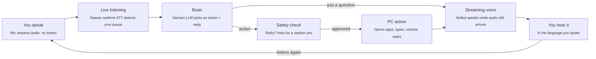

# Startup-Sarvam: Voice-Controlled PC Assistant

**Talk to your computer in your own language. It does the task and answers you out loud.**

A real-time voice assistant that lets anyone control a Windows PC by speaking Hindi, English, Hinglish, Tamil, Telugu, Kannada, Bengali and other Indian languages. All the AI runs on [Sarvam AI](https://www.sarvam.ai/)'s speech and language models.

> "Notepad kholo" · "YouTube pe Arijit Singh ke gaane lagao" · "Ek chhutti ki application likho"

The assistant understands you, acts on the PC and replies in the same language within a second or two. You do not press a button. You just speak.

---

## Table of contents

- [Why this exists](#why-this-exists)
- [Who it is for](#who-it-is-for)
- [How it works](#how-it-works)
- [Features](#features)
- [Safety and sandbox](#safety-and-sandbox)
- [Tech stack](#tech-stack)
- [Getting started](#getting-started)
- [Adding a new ability](#adding-a-new-ability)
- [Roadmap](#roadmap)
- [Known risks and open questions](#known-risks-and-open-questions)
- [References](#references)
- [License](#license)

---

## Why this exists

Most of India does not think in English, but computers still expect English menus, English typing and mouse skills.

- Elderly people and first-time users get stuck on basic tasks like opening an app, finding a file or filling a form.
- Non-English speakers depend on someone else to use government sites, pay bills or write a letter.
- Existing assistants (Windows Copilot, Google Assistant, Siri) are English-first and weak at Hinglish or regional languages.
- Voice agents that control a computer are risky: a misheard command can close your work or delete files.

This project puts Indian-language voice at the centre and makes safety a core part of the design.

## Who it is for

- Elderly users and first-time computer users
- People more comfortable in Hindi, Tamil, Telugu, Kannada, Bengali or another Indian language than in English
- Small shops and offices where staff need to get computer work done without training
- Anyone whose hands are busy, or who has low vision

## How it works

One spoken sentence becomes an action and a spoken reply.



1. The mic streams live audio to Sarvam's realtime speech-to-text.
2. When you pause, the final transcript goes to the brain.
3. The brain picks one safe action and writes the spoken reply in a single function-calling request.
4. Risky actions go through a spoken confirmation first.
5. The reply voice starts playing before the full audio is generated.
6. Plain questions skip the action step and go straight to the answer.
7. The loop starts listening again right away.

## Features

The first version handles **15 PC actions** plus general questions, in real time.

| Feature | Example command | What happens |
|---|---|---|
| Live mode | Just talk, no button | Words appear on screen as you speak; it acts when you pause |
| Open and close apps | "Chrome kholo" | Opens Chrome; closing asks for confirmation first |
| Web and YouTube search | "YouTube pe bhajan lagao" | Opens the search results |
| Volume control | "Volume 40 kar do" | Sets the volume to 40% |
| Voice typing, any language | "Likho: kal meeting hai" | Types the text into the open window |
| Write and save notes | "Chhutti ki application likho" | Writes the letter, saves it and opens it |
| Shortcuts and scrolling | "Save karo", "Neeche scroll karo" | Presses Ctrl+S or scrolls |
| Screenshot | "Screenshot lo" | Saves a screenshot to Documents |
| System status | "Battery kitni hai?" | Speaks battery, CPU and memory use |
| Lock and shutdown | "PC band karo" | Asks "are you sure?"; shutdown waits 60 s and can be cancelled |
| General questions | "Bharat ki rajdhani kya hai?" | Answers out loud |
| Memory | "Chrome kholo", then "ab isko band karo" | Remembers the last few turns |

**Extras**

- **Interrupt:** a button (or **F9**) stops the assistant mid-sentence.
- **Wake word (optional):** the assistant ignores nearby chatter until you call it.
- **Speed readout:** latency is shown after every reply.

## Safety and sandbox

The AI can only do what it has permission to do, and it asks before anything risky.

### Built into the code (always on)

| Guard | What it does |
|---|---|
| Allow-list | The AI can only call functions defined in the actions file, never arbitrary commands. |
| Spoken confirmation | Closing apps, locking and shutting down need a clear "haan" or "yes". Anything unclear counts as no. |
| Limited keys | Keyboard shortcuts are restricted to a safe list. |
| Delayed shutdown | Shutdown waits 60 seconds and can be cancelled by voice. |
| Action log | Every action is written to a log file. |
| Emergency stop | Moving the mouse to a screen corner stops all automation (pyautogui failsafe). |
| No self-hearing | The mic mutes while the assistant speaks. |

### Sandbox for testing new, riskier abilities

1. **Windows Sandbox** (Windows 10/11 Pro): a throwaway copy of Windows that is wiped when closed. A ready config file maps the project folder in, with the mic and internet turned on.
2. **VirtualBox VM** (free, works on Windows Home): save a snapshot once it is set up, and roll back in seconds if anything breaks.

Test any new action that touches files, windows or system state in one of these first.

## Tech stack

A Python desktop app. All AI comes from Sarvam's models.

| Part | Technology | Role |
|---|---|---|
| Live listening | Sarvam Saaras realtime STT (`saaras:v3-realtime`) over WebSocket | Streams the mic in 100 ms chunks, returns live and final text, detects end of speech |
| Push-to-talk STT | Sarvam Saaras (`saaras:v4`) | Fallback transcription, auto-detects 22 Indian languages |
| Brain | Sarvam `sarvam-105b-conversations` with function calling | Picks the right action and writes the spoken reply in one call |
| Voice | Sarvam Bulbul (`bulbul:v3`) streaming TTS | Starts speaking before the full audio is generated |
| PC control | `pyautogui`, `psutil`, `pycaw`, `webbrowser` | Opens apps, types, controls volume, takes screenshots |
| Audio | `sounddevice`, `numpy`, `scipy` | Mic capture and speaker playback |
| App window | `customtkinter` | Live mode switch, live transcript, activity log, speed readout |

The code is about 900 lines across 14 files, one file per job: listening, brain, actions, safety, voice and window.

## Getting started

### Prerequisites

- Windows 10 or 11
- Python 3.10+
- A working microphone and speakers
- A Sarvam AI API key from the [Sarvam dashboard](https://dashboard.sarvam.ai/)

### Setup

```bash
git clone https://github.com/manavagarwal123/Startup-Sarvam.git
cd Startup-Sarvam

python -m venv .venv
.venv\Scripts\activate

pip install customtkinter pyautogui psutil pycaw sounddevice numpy scipy websockets requests
```

Set your API key as an environment variable:

```powershell
$env:SARVAM_API_KEY = "your-key-here"
```

> Live mode streams audio continuously and uses Sarvam credits. Turn it off when you do not need it.

## Adding a new ability

A new ability takes one function plus one line:

1. Write a Python function for the action in the actions file.
2. Register it in the allow-list so the brain can call it.

If the action is risky (closes something, changes system state, deletes data), route it through the spoken-confirmation check and test it in the sandbox first.

## Roadmap

The core assistant is built. Next, it moves from doing tasks to teaching and learning them.

- [x] **Real-time voice assistant:** live listening, 15 PC actions, replies in the user's language, safety layer, sandbox config
- [ ] **Test with real users:** try it with 5–10 elderly and non-English users, fix misheard commands and missing actions
- [ ] **Teach me mode:** look at the screen, highlight where to click and explain each step in the user's language
- [ ] **Screen reader and translator:** read or explain anything on screen, like an error message or an English webpage, in Hindi, Tamil and other languages
- [ ] **Learn it mode:** a family member shows a task once, like downloading a bill, and the assistant repeats it by voice from then on
- [ ] **Family remote help:** a stuck user says "call my son", and a family member sees the screen and guides them from a phone

## Known risks and open questions

- **Accuracy:** commands get misheard in noisy homes. Mitigation: noise and pause tuning, a wake word and confirmations.
- **Teach and learn modes are hard:** screen layouts change and recorded clicks break. Plan: start with one or two popular sites.
- **Cost:** live mode streams audio continuously and uses Sarvam credits. It turns off when not in use.
- **Platform:** Windows only for now. Mac and Linux need their own app controls.
- **Open question:** which user group to focus on first: elderly users, small shops, or government-service help.

## References

- [Sarvam Speech-to-Text API](https://docs.sarvam.ai/api-reference-docs/speech-to-text/transcribe)
- [Sarvam realtime streaming STT](https://docs.sarvam.ai/api-reference-docs/speech-to-text/transcribe/ws)
- [Sarvam Chat Completions API](https://docs.sarvam.ai/api-reference-docs/chat/completions)
- [Sarvam Text-to-Speech overview](https://docs.sarvam.ai/api-reference-docs/text-to-speech/convert)
- [Sarvam TTS streaming API](https://docs.sarvam.ai/api-reference-docs/text-to-speech/convert/ws)

## License

[MIT](LICENSE) © 2026 Manav Agarwal
