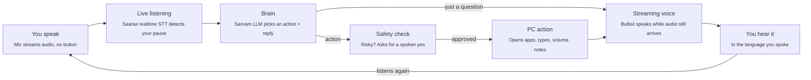

# Startup-Sarvam: Voice-Controlled PC Assistant

**Talk to your computer in your own language. It does the task and answers you out loud.**

A real-time voice assistant that lets anyone control a Windows PC by speaking Hindi, English, Hinglish, Tamil, Telugu, Kannada, Bengali and other Indian languages. All the AI runs on [Sarvam AI](https://www.sarvam.ai/)'s speech and language models.

> "Notepad kholo" · "YouTube pe Arijit Singh ke gaane lagao" · "Ek chhutti ki application likho"

The assistant understands you, acts on the PC and replies in the same language within a second or two. You do not press a button. You just speak.

---

## Table of contents

- [Why this exists](#why-this-exists)
- [Who it is for](#who-it-is-for)
- [How it works](#how-it-works)
- [Features](#features)
- [Safety and sandbox](#safety-and-sandbox)
- [Tech stack](#tech-stack)
- [Getting started](#getting-started)
- [Voice commands](#voice-commands)
- [Adding a new ability](#adding-a-new-ability)
- [Database](#database)
- [Troubleshooting](#troubleshooting)
- [Project layout](#project-layout)
- [Roadmap](#roadmap)
- [Known risks and open questions](#known-risks-and-open-questions)
- [References](#references)
- [License](#license)

---

## Why this exists

Most of India does not think in English, but computers still expect English menus, English typing and mouse skills.

- Elderly people and first-time users get stuck on basic tasks like opening an app, finding a file or filling a form.
- Non-English speakers depend on someone else to use government sites, pay bills or write a letter.
- Existing assistants (Windows Copilot, Google Assistant, Siri) are English-first and weak at Hinglish or regional languages.
- Voice agents that control a computer are risky: a misheard command can close your work or delete files.

This project puts Indian-language voice at the centre and makes safety a core part of the design.

## Who it is for

- Elderly users and first-time computer users
- People more comfortable in Hindi, Tamil, Telugu, Kannada, Bengali or another Indian language than in English
- Small shops and offices where staff need to get computer work done without training
- Anyone whose hands are busy, or who has low vision

## How it works

One spoken sentence becomes an action and a spoken reply.



1. The mic streams live audio to Sarvam's realtime speech-to-text.
2. When you pause, the final transcript goes to the brain.
3. The brain picks one safe action and writes the spoken reply in a single function-calling request.
4. Risky actions go through a spoken confirmation first.
5. The reply voice starts playing before the full audio is generated.
6. Plain questions skip the action step and go straight to the answer.
7. The loop starts listening again right away.

## Features

The first version handles **16 PC actions** plus general questions, in real time.

| Feature | Example command | What happens |
|---|---|---|
| Live mode | Just talk, no button | Words appear on screen as you speak; it acts when you pause |
| Open and close apps | "Chrome kholo" | Opens Chrome; closing asks for confirmation first |
| Web and YouTube search | "YouTube pe bhajan lagao" | Opens the search results |
| Volume control | "Volume 40 kar do" | Sets the volume to 40% |
| Voice typing, any language | "Likho: kal meeting hai" | Types the text into the open window |
| Write and save notes | "Chhutti ki application likho" | Writes the letter, saves it and opens it |
| Shortcuts and scrolling | "Save karo", "Neeche scroll karo" | Presses Ctrl+S or scrolls |
| Screenshot | "Screenshot lo" | Saves a screenshot to Documents |
| System status | "Battery kitni hai?" | Speaks battery, CPU and memory use |
| Lock and shutdown | "PC band karo" | Asks "are you sure?"; shutdown waits 60 s and can be cancelled |
| General questions | "Bharat ki rajdhani kya hai?" | Answers out loud |
| Memory | "Chrome kholo", then "ab isko band karo" | Remembers the last few turns |

**Extras**

- **Interrupt:** a button (or **F9**) stops the assistant mid-sentence.
- **Wake word (optional):** the assistant ignores nearby chatter until you call it.
- **Speed readout:** latency is shown after every reply.

## Safety and sandbox

The AI can only do what it has permission to do, and it asks before anything risky.

### Built into the code (always on)

Every action goes through one function, `assistant/safety.py: execute()`. It applies these checks in order:

| Step | Guard | What happens |
|---|---|---|
| 1 | Allow-list | Only functions registered in `assistant/actions.py` can run. Anything else is `blocked`. The AI can never run shell commands, and no command string is ever built from AI output. |
| 2 | Argument check | Arguments must match the action's JSON schema: types, fixed choices (`enum`), ranges and required fields. Extra fields are rejected. Failures are an `error`. |
| 3 | Rate limit | At most `MAX_ACTIONS_PER_MINUTE` (default 10) actions per minute, so a looping AI cannot spam the PC. |
| 4 | Spoken confirmation | Closing apps, locking and shutting down need a clear "haan", "हाँ", "yes", "சரி", etc. Any "no" word, silence, a question or noise counts as no (`denied`). The action function is never called without that yes. |
| 5 | Honest replies | If an action was denied, blocked or failed, the spoken reply says so. The assistant never says "done" when nothing happened. |
| 6 | Action log | Every attempt is written to `logs/actions.log` and to the `actions` table in the database. |

Also always on:

- **Limited keys:** keyboard shortcuts come from a fixed safe list (save, copy, paste, undo, …). Alt+F4 and Win+R are not on it.
- **Delayed shutdown:** shutdown waits 60 seconds (`SHUTDOWN_DELAY_S`) and can be cancelled by voice ("shutdown cancel karo").
- **Emergency stop:** moving the mouse to a screen corner stops all automation (pyautogui failsafe).
- **No self-hearing:** the mic is muted while the assistant speaks and for 300 ms after.
- **Never kills Explorer:** `close_app` only knows a fixed list of apps, and the file manager is not on it.

### Sandbox for testing new, riskier abilities

1. **Windows Sandbox** (Windows 10/11 Pro): a throwaway copy of Windows, wiped when closed. `sandbox/Startup-Sarvam.wsb` maps the project folder in read-only, with the mic and internet on.
2. **VirtualBox VM** (free, works on Windows Home): take a snapshot once it is set up, and roll back in seconds if anything breaks.

Step-by-step instructions: [sandbox/README.md](sandbox/README.md).

## Tech stack

A Python desktop app. All AI comes from Sarvam's models. Every API detail is checked against the official docs in [docs/sarvam_api_notes.md](docs/sarvam_api_notes.md).

| Part | Technology | Role |
|---|---|---|
| Live listening | Sarvam `saaras:v3-realtime` over WebSocket (`/speech-to-text-realtime/ws`) | Streams the mic in 100 ms chunks, returns live and final text, and detects the end of speech on the server |
| Push-to-talk STT | Sarvam `saaras:v4` (`POST /speech-to-text`) | Hold-to-talk transcription with automatic language detection |
| Brain | Sarvam `sarvam-105b` with function calling (`POST /v1/chat/completions`) | Picks the action and writes the spoken reply. You can switch to `sarvam-105b-conversations` in `.env`. |
| Voice | Sarvam `bulbul:v3`, HTTP streaming (`POST /text-to-speech/stream`) | Starts speaking before the full audio is generated |
| HTTP / WebSocket | `httpx`, `websockets` | One shared client with auth, timeouts and retries |
| PC control | `pyautogui`, `pyperclip`, `psutil`, `pycaw`, `webbrowser` | Opens apps, types, controls volume, takes screenshots |
| Audio | `sounddevice`, `numpy` | Mic capture (16 kHz) and speaker playback (24 kHz) |
| Memory | SQLite (`sqlite3`) | Conversation turns, actions and long-term facts |
| App window | `customtkinter` | Live mode switch, live transcript, activity log, speed readout |

About 3,800 lines of code in 24 files, plus about 2,200 lines of tests.

## Getting started

### Prerequisites

- Windows 10 or 11
- Python 3.11 or newer
- A working microphone and speakers
- A Sarvam AI API key from the [Sarvam dashboard](https://dashboard.sarvam.ai/)

### Setup

```powershell
git clone https://github.com/manavagarwal123/Startup-Sarvam.git
cd Startup-Sarvam

python -m venv .venv
.venv\Scripts\activate
pip install -r requirements.txt          # add -r requirements-dev.txt to run tests

copy .env.example .env
notepad .env                             # put your key in SARVAM_API_KEY=
```

All settings live in `.env`. See `.env.example` for the full list: voice, wake word, models, timeouts and paths.

> Live mode streams audio continuously and uses Sarvam credits. Turn it off when you do not need it. When it is off, the WebSocket is closed.

### Run it

| Command | What it does |
|---|---|
| `python main.py` | Window, live listening on. Just speak. |
| `python main.py --ptt` | Window, push-to-talk. Hold the **Hold to talk** button or **F8** while speaking. |
| `python main.py --no-ui` | Terminal only, live listening. Ctrl+C quits. |
| `python main.py --no-ui --ptt` | Terminal only, hold **F8** to talk. |
| `python main.py --text` | Type commands instead of speaking. Good for testing without a mic. |
| `python main.py --mock` | **No API key needed.** Window with a typing box. Keyword rules stand in for Sarvam (`sarvam/mock.py`). Real actions, safety checks and memory still run. |
| `python main.py --mock --text` | Same, in the terminal. |
| `--debug` | Add to any mode for detailed logs. |

In mock mode, replies are printed with a `[voice]` prefix. They are also spoken with the offline Windows voice if you `pip install pyttsx3`. Live listening and push-to-talk are off, because both need Sarvam speech-to-text. Mock mode understands only fixed phrases such as "notepad kholo", "isko band karo", "volume 30", "mera naam X hai", "battery", "application likho" and "pc band karo". Anything else gets "Mock mode: samajh nahi aaya".

**F9** stops the assistant mid-sentence in every voice mode.

### Run the tests

```powershell
pip install -r requirements-dev.txt
python -m pytest -q
ruff check .
```

The tests never shut down, lock, close apps, type or change the volume on your PC. All of that is mocked. They also never call the Sarvam API.

## Voice commands

Say them in any supported language. These are examples; the AI understands many other phrasings.

| Action | Example commands | Confirmation |
|---|---|---|
| `open_app` | "Notepad kholo", "क्रोम खोलो", "Open calculator" | |
| `close_app` | "Chrome band karo", "ab isko band karo" (closes the last app you opened) | asks first |
| `web_search` | "Google pe train ticket search karo" | |
| `youtube_search` | "YouTube pe bhajan lagao" | |
| `set_volume` | "Volume 30 kar do" | |
| `change_volume` | "Awaaz badhao", "Volume kam karo", "Mute karo" | |
| `type_text` | "Likho: kal meeting hai" (works in Hindi, Tamil and every other script) | |
| `press_shortcut` | "Save karo", "Copy karo", "Naya tab kholo", "Zoom in karo" | |
| `scroll` | "Neeche scroll karo", "Thoda upar karo" | |
| `take_screenshot` | "Screenshot lo" | |
| `system_status` | "Battery kitni hai?", "बैटरी कितनी है?" | |
| `lock_pc` | "Computer lock karo" | asks first |
| `shutdown_pc` | "PC band karo" (waits 60 s) | asks first |
| `cancel_shutdown` | "Shutdown cancel karo" | |
| `save_note` | "Chhutti ki application likho", "Ek note likho ki doodh lana hai" | |
| `current_time` | "Kitne baje hain?", "Aaj kaun si tareekh hai?" | |
| memory | "Mera naam Harsh hai", "Mera naam kya hai?", "Sab bhool jao" | |
| questions | "Bharat ki rajdhani kya hai?" | |

**Apps that `open_app` knows:** notepad, calculator, paint, file manager, chrome, edge, word, excel, powerpoint, settings, camera.

**Shortcuts that `press_shortcut` knows:** save, copy, paste, undo, redo, select all, new tab, close tab, refresh, enter, minimise all, switch window, zoom in, zoom out.

## Adding a new ability

A new ability is one function plus one decorator in `assistant/actions.py`:

```python
@action(
    "Open the Downloads folder.",          # description the AI reads
    params={},                              # JSON-schema properties; use "enum" for fixed choices
    required=[],
    risky=False,                            # True = ask for a spoken yes first
    informational=False,                    # True = result goes back to the AI to phrase an answer
)
def open_downloads() -> str:
    _startfile(str(Path.home() / "Downloads"))
    return "Opened Downloads"
```

That is all. The tool schema is built automatically, and the safety gate validates arguments and logs every call. Rules:

- Never use `shell=True`, and never build a command string from AI-supplied text. Pass fixed argument lists.
- Use `enum` for any fixed set of choices.
- Import Windows-only libraries inside the function so the tests run anywhere.
- Mark anything that closes, deletes or changes system state `risky=True`, add a confirmation phrase in `language/phrases.py` (`confirm_<name>`), and test it in the sandbox first.
- Add a test in `tests/test_actions.py` with the side effect mocked.

## Database

Memory is a SQLite file at `data/assistant.db` (`DB_PATH`). It is created on first run and is gitignored.

| Table | What it holds |
|---|---|
| `sessions` | One row per app run: `started_at`, `ended_at`, `language` |
| `messages` | Every user and assistant turn (`role`, `content`, `language`). The last `HISTORY_TURNS` turns are sent to the AI. |
| `actions` | Every action attempt: `name`, `args` (JSON), `result`, `status` (`ok` / `error` / `denied` / `blocked`), `duration_ms` |
| `facts` | Long-term memory such as name and city (`key`, `value`). Kept when you say "sab bhool jao". |
| `schema_version` | Lets the schema change later without losing data |

Inspect it:

```powershell
python -c "import sqlite3; c=sqlite3.connect('data/assistant.db'); [print(r) for r in c.execute('select name,status,result,created_at from actions order by id desc limit 20')]"
```

Or open the file in [DB Browser for SQLite](https://sqlitebrowser.org/).

## Troubleshooting

| Problem | Fix |
|---|---|
| `Configuration error: SARVAM_API_KEY is not set` | Create `.env` in the project folder (copy `.env.example`) and put your key in it. |
| `HTTP 403 … (check SARVAM_API_KEY)` or "API key rejected" | The key is wrong or expired. Copy it again from the Sarvam dashboard. |
| `HTTP 429` | Rate limit or credits used up. The app retries twice. Check your credits on the dashboard. |
| "Microphone not available" | Check Windows Settings → Privacy & security → Microphone: allow desktop apps. Pick a device with `MIC_DEVICE` (index or name). List devices with `python -m sounddevice`. |
| It hears itself | Use headphones, or keep `BARGE_IN=false` (the default), which mutes the mic while speaking. |
| Volume commands fail (pycaw / COM errors) | Update with `pip install -U pycaw comtypes`. Check that a playback device is connected and set as default. |
| Hindi or Tamil text is typed as `????` | `type_text` pastes through the clipboard, so the target app must accept pasted Unicode text (Notepad and Word do). Some old apps and terminals do not. |
| F8 / F9 hotkeys do nothing | The `keyboard` library may need the terminal to run as administrator on some PCs. The window buttons always work. |
| Hindi shows as boxes in the window | Windows needs the **Nirmala UI** font (installed by default on Windows 10/11). |
| Replies are slow | Set `SARVAM_LLM_REASONING=none` and/or `SARVAM_LLM_MODEL=sarvam-105b-conversations` in `.env`. The speed readout shows which stage is slow. |
| Logs | `logs/app.log` (everything) and `logs/actions.log` (every PC action). |

## Project layout

```
main.py                 entry point and terminal modes
assistant/              config, logging, memory, actions, safety, brain, pipeline
sarvam/                 HTTP client, LLM, realtime + REST STT, TTS
audio/                  microphone, speaker, wake word
language/               script detection, yes/no words, canned replies
ui/app.py               the window
sandbox/                Windows Sandbox config + VM guide
tests/                  pytest suite (everything mocked)
docs/                   Sarvam API notes and build plan
```

## Roadmap

The core assistant is built. Next, it moves from doing tasks to teaching and learning them.

- [x] **Real-time voice assistant:** live listening, 16 PC actions, replies in the user's language, safety layer, sandbox config
- [ ] **Test with real users:** try it with 5–10 elderly and non-English users, fix misheard commands and missing actions
- [ ] **Teach me mode:** look at the screen, highlight where to click and explain each step in the user's language
- [ ] **Screen reader and translator:** read or explain anything on screen, like an error message or an English webpage, in Hindi, Tamil and other languages
- [ ] **Learn it mode:** a family member shows a task once, like downloading a bill, and the assistant repeats it by voice from then on
- [ ] **Family remote help:** a stuck user says "call my son", and a family member sees the screen and guides them from a phone

## Known risks and open questions

- **Accuracy:** commands get misheard in noisy homes. Mitigation: noise and pause tuning, a wake word and confirmations.
- **Teach and learn modes are hard:** screen layouts change and recorded clicks break. Plan: start with one or two popular sites.
- **Cost:** live mode streams audio continuously and uses Sarvam credits. It turns off when not in use.
- **Platform:** Windows only for now. Mac and Linux need their own app controls.
- **Open question:** which user group to focus on first: elderly users, small shops, or government-service help.

## References

- [Sarvam Speech-to-Text API](https://docs.sarvam.ai/api-reference/speech-to-text/transcribe)
- [Sarvam realtime streaming STT](https://docs.sarvam.ai/api-reference/speech-to-text/transcribe/realtime/ws)
- [Sarvam Chat Completions API](https://docs.sarvam.ai/api-reference/chat/chat-completions-v1)
- [Sarvam Text-to-Speech API](https://docs.sarvam.ai/api-reference/text-to-speech/convert)
- [Sarvam TTS streaming API](https://docs.sarvam.ai/api-reference/text-to-speech/convert-stream)
- [Verified API notes for this project](docs/sarvam_api_notes.md)

## License

[MIT](LICENSE) © 2026 
