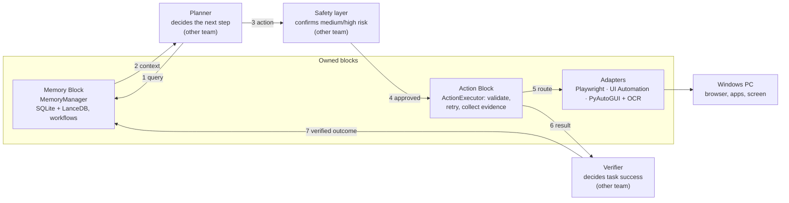

# Memory & Action Blocks — Functional Design

2026-10-03 · Startup-Sarvam · branch `memory_action`

## 1. Overview and scope

The Memory Block and Action Block give the Startup-Sarvam voice assistant two things: a safe, closed way to act on the PC, and a record of what it knows from earlier tasks. Both are Python packages (`actions/`, `memory/`) on branch `memory_action`, built to `memory_action_spec.md`.

| Block | Answers | Entry point |
| --- | --- | --- |
| Action | How do I safely carry out this one computer interaction? | `ActionExecutor` |
| Memory | What do we already know that is relevant to this task? | `MemoryManager` |
| Planner (not owned) | What should happen next? | — |

**In scope:** action schemas and validation, the capability allow-list, routing to browser / Windows / visual adapters, timeouts, retries, evidence and structured results; memories with provenance, confidence and freshness, hybrid search, privacy filtering, working memory, and workflows with verification history.

**Out of scope (owned by other teams):** planning and LLM calls, the spoken yes/no confirmation and other safety policy, task-level verification, speech, the language layer and the UI. The two blocks never call each other; the planner connects them.

## 2. Architecture and flow



One voice command runs through the numbered steps: the planner asks Memory for context (1–2), sends an action through the safety layer (3–4), the executor routes it to an adapter (5) and returns an `ActionResult` (6), and the verifier writes the verified outcome back to Memory (7).

- **First run** (no workflow yet): `get_workflow` returns nothing, the planner builds the actions itself, and after a verified success the run is saved as a workflow.
- **Later run:** `get_workflow` returns a match. If it is current, its steps are the starting point, its preconditions are re-checked on the live screen, and the run is appended to its verification history. If it is stale or failing, the planner adapts it instead of replaying it.

## 3. Action Block: capabilities and routing

Only 12 registered capabilities can run; there is no capability for Python, shell or PowerShell. The registry also produces the function-calling tool list, so the LLM is only offered actions the executor accepts.

| Capability | Target | Default surface | Safe to repeat | Default risk |
| --- | --- | --- | --- | --- |
| `open_app` | none (allow-listed app name) | window | no | low |
| `open_url` | none (http/https only) | browser | yes | low |
| `click` | element required | per target | no | medium |
| `type` | optional (focused element if none) | screen | no | medium |
| `press_key` | optional (allow-listed key) | screen | no | low |
| `hotkey` | optional (allow-listed combo, e.g. ctrl+s) | screen | no | medium |
| `scroll` | optional | screen | no | low |
| `read` | page/window or element | per target | yes | low |
| `screenshot` | optional | screen | yes | low |
| `wait` | none (seconds, or until a condition) | executor | yes | low |
| `download` | element or URL (browser) | browser | no | low |
| `close_app` | none (allow-listed app; graceful close) | window | no | medium |

**Targets and adapters.** A target names a surface and how to find the thing on it. The surface picks the adapter:

- `browser` → Playwright, preferring accessibility locators (role + name, label, placeholder, text) over CSS selectors. A persistent profile keeps logins; the channel is set to real Chrome.
- `window` → Windows UI Automation (pywinauto): a window-title regex plus control name, type or automation id.
- `screen` → visual adapter (PyAutoGUI): a coordinate `point`, or visible `text` found by OCR. Used only for screen targets or as an explicit fallback.

**Preconditions and expected outcomes.** Each action can carry conditions: element visible or hidden, text present, URL or title contains, window exists or absent, file exists, download completed, or a free-text `custom` expectation. Preconditions are checked first (optionally waiting up to 60 s); an unmet one stops the action. Expected outcomes are checked after it runs and reported, never used to flip `success`.

## 4. Action Block: execution behaviour

`execute()` never raises for action problems: every outcome is an `ActionResult`, so the planner always gets something to decide on. Pipeline: validate → capability check → allow-lists → route → preconditions → run (timeout, retries, fallback) → evidence → expected-outcome checks.

**ActionResult fields:** `success`, `action_id`, `action_type`, `output`, `evidence[]`, `error`, `duration_ms`, `retryable`, `attempts`, `adapter`, `risk`, `precondition_checks[]`, `outcome_checks[]`, `started_at`, `finished_at`, plus `expected_outcomes_met` (true / false / unknown).

`success` means the interaction happened, not that the task worked. Clicking Download can succeed while no file appears; `expected_outcomes_met = false` shows that, and the verifier decides.

**Evidence** is observation only: screenshots (on failure, and before/after every visual action), URL, page title, window title, the element acted on, OCR position, observed text and download path.

**Errors** are structured (`error_type`, `message`, `adapter`, `target`, `retryable`, `details`):

| Error | Typical cause | Retryable |
| --- | --- | --- |
| `ValidationError` | bad schema or parameters | no |
| `UnsupportedActionError` | unregistered or disabled capability, no adapter or OCR on this machine | no |
| `PermissionError` | app/key/hotkey not allowed, PyAutoGUI fail-safe | no |
| `TargetNotFoundError` | element, control or on-screen text not found | yes |
| `PreconditionFailedError` | a precondition did not hold | yes |
| `TimeoutError` | exceeded the time budget | only if safe to repeat |
| `VerificationError` | a `wait` condition never held | yes |
| `AdapterError` | anything else from the browser or desktop | usually no |

**Timeouts and retries.** Every action is bounded: 30 s by default, 120 s maximum. Retries default to at most 2 attempts, capped at 3. A failure is retried only if it is transient **and** repeating cannot duplicate an effect: a missing target is retried even for a click (nothing happened yet), but a click that timed out is not. If a Windows or PyAutoGUI call is still stuck after its timeout, its thread is abandoned and a fresh one serves the next action; anything queued behind the stuck call is refused rather than run late.

**Visual fallback.** With `allow_visual_fallback`, a browser or window action whose locator fails is retried once on the screen: at the given `point`, or at the element's visible text located by OCR. The result records the fallback as evidence.

**Warm-up.** `executor.warm_up()` at app start-up pays one-time setup (UI Automation, PyAutoGUI), which cost about 10 s on a cold first use.

**Safety boundary.** The Action Block enforces schemas, allow-lists and technical limits. It never decides whether a risky action is appropriate: each result carries a `risk` level (low / medium / high) for the safety layer, which owns the spoken confirmation.

## 5. Memory Block: memories and lifecycle

A memory is context, not truth: every record says where it came from, how sure we are, and when it was last confirmed. SQLite is the source of truth; nothing outside `MemoryManager` touches storage.

**Types:** `fact`, `preference`, `episode`, `observation`. Workflows are a separate model (section 7).

| Field | Meaning |
| --- | --- |
| `id` | `mem_…`, generated |
| `type` | one of the four types |
| `content` | text or structured JSON |
| `source` | `user` (stated), `agent` (inferred), `system` (configured), `execution` (observed) |
| `confidence` | 0–1; defaults by source: user 0.9, system 0.9, execution 0.8, agent 0.5 |
| `status` | `active` or `invalid` (retracted, kept for audit) |
| `created_at`, `updated_at` | UTC timestamps |
| `last_verified_at` | last confirmation; moves only through `verify()` |
| `expires_at` | optional end of validity |
| `metadata` | tags, application, domain, execution id, source reference, verification method, redactions |

**Freshness** is derived at read time, never stored:

- **verified**: confirmed within the last 90 days (configurable)
- **unverified**: recent but never confirmed
- **stale**: last confirmation (or creation, if never confirmed) is older than 90 days
- **expired**: past `expires_at`; still returned, as history
- **invalid**: explicitly retracted; hidden from search unless asked

**Verification rules.** Retrieval never counts as verification. Things the user states are verified when saved (method `user_statement`). Other memories become verified only through `verify(id, method=…)` (e.g. successful execution, user confirmation, current observation), which is logged with its evidence. Changing a memory's content clears its verification, since the old confirmation applied to the old content. `forget()` deletes a memory, its verification log and its vector permanently.

**Working memory** holds the current task in RAM only and is never persisted: task, application, page, task state, the last 20 conversation turns (so "ab isko band karo" can resolve "isko"), recent observations, recent action results and pending actions. Starting a new task clears task state but keeps conversation turns.

## 6. Retrieval

Search combines exact keyword matching and meaning-based matching, ranks with one fixed formula, and drops anything below a relevance threshold rather than padding the context.

1. **Keyword candidates** from SQLite FTS5. The tokenizer keeps Hindi vowel signs inside words; the default one splits "बिजली" into fragments so "बिल" would wrongly match it. English, Hinglish and Hindi stopwords are ignored. Keyword score = share of the query's meaningful words found in the record (prefix match).
2. **Semantic candidates** from LanceDB, using `paraphrase-multilingual-MiniLM-L12-v2` (384 dimensions, local, about 220 MB, no PyTorch). Semantic score = cosine similarity rescaled so 0.3 maps to 0.
3. **Merge and rank.** Records are loaded from SQLite (vectors without a record are ignored), then scored. Ranking weights are configurable.
4. **Filter.** Relevance below 0.2 is dropped; invalid memories are dropped; expired ones are kept but flagged.

```
relevance = min(1, max(k, s) + 0.25 × min(k, s))
score     = relevance × (0.5 + 0.5 × confidence) × freshness_weight
```

Here k is the keyword score, s the semantic score, and the freshness weight is verified 1.0, unverified 0.9, stale 0.7, expired 0.4.

**Result.** Each hit (`RetrievedMemory`) carries the memory, its score parts, its freshness and a plain-language `caveat` for anything not freshly verified, e.g. "Recorded 2025-08-01 and never verified; may be out of date." `is_confirmed` is true only for verified memories.

**Context for the planner.** `build_context(query)` returns relevant memories, candidate workflows and the working-memory snapshot; `to_prompt()` renders them as text headed "context, not guaranteed truth", with caveats inline.

**Tuning.** `python -m memory.evaluation <dataset> --tune` scores the ranking on a labelled query set and grid-searches the thresholds. With `MEMORY_RETRIEVAL_LOG_PATH` set, every search is logged with the query redacted, and `record_search_feedback(search_id, used_ids)` records which results the planner actually used; those pairs become new evaluation cases.

## 7. Workflows

A workflow is a learned procedure, such as "download the electricity bill". It is stored only after a verified successful run and is never replayed blindly.

**Model.** Goal and description; preconditions; ordered steps; final expected outcomes; failure conditions; verification history; source execution id; confidence (default 0.6); status; created, updated, last-verified and expiry timestamps; version; metadata (application, domain, tags).

- Each **step** has an order, a description, an `action_type`, a target, parameters, and an expected outcome in words and/or as checkable conditions. `step.to_action_payload()` produces a dict that `ActionExecutor.execute` accepts, while Memory never imports the Action package.
- Each **condition** always has a description; `kind`/`target`/`value` make it machine-checkable, otherwise it is passed on as a `custom` check for the verifier.
- Each **verification** records execution id, time, success, evidence, observed changes, notes and the workflow version it ran.

**Storage rule.** `save_workflow` refuses a workflow whose history has no successful run. Failed attempts belong in `episode` memories, not in reusable workflows.

**Freshness** (only runs of the current version count):

- **current**: last run succeeded within 30 days (configurable)
- **unverified**: the current version has never succeeded
- **stale**: last success is older than 30 days, so the site or app may have changed
- **failing**: the most recent run failed
- **expired**: past `expires_at`; history only
- **invalid**: retired

**Updates and versions.** `record_workflow_verification` appends a run: success refreshes `last_verified_at` and raises confidence by 0.05 (max 0.95); failure lowers it by 0.15 (min 0.05). Changing preconditions, steps, outcomes or failure conditions creates a new version, archives the old one, and makes the workflow unverified until it succeeds again. Goal, metadata or confidence edits keep the version.

**Replay rules for the planner.** Use `get_workflow(task)` as a starting point only when `is_current`, re-check its preconditions against the live screen, and adapt any step that fails. Steps whose input was a password or other sensitive text are stored with `requires_user_input` instead of the text, so the user must supply it again.

## 8. Privacy and security

The LLM can only reach the computer through 12 validated capabilities, and secrets are removed before anything is written to disk.

| Control | Where | What it does |
| --- | --- | --- |
| No code execution | Action registry | No Python, shell or PowerShell capability exists; unknown action types are refused. |
| App allow-list | `open_app`, `close_app` | Only configured apps; started as an argument list without a shell; closed gracefully, never killed. |
| Key and hotkey allow-lists | `press_key`, `hotkey` | Only listed keys and combinations (e.g. ctrl+alt+delete and win+r are refused). |
| URL restriction | `open_url`, `download` | Absolute http/https only (no `file:`, `javascript:`). |
| Download names | browser adapter | File names sanitised; no path components; no overwrites. |
| Sensitive typing | `type` with `sensitive: true` | Text masked in logs; validation errors never echo input. |
| Emergency stop | visual adapter | Mouse in a screen corner triggers PyAutoGUI's fail-safe and stops automation. |
| Redaction before storage | `MemoryManager` | Passwords, OTPs, PINs, API keys, auth tokens, session cookies, private keys, card numbers and CVVs (English, Hinglish and Hindi phrasing), plus values under sensitive-looking keys, become `[REDACTED:<kind>]`. Applies to memories, metadata, verification evidence, workflows and the search log. |
| Workflow inputs | `save_workflow` | Sensitive typed text is replaced and the step marked `requires_user_input`. |
| Storage access | `MemoryManager` | Only public API; SQLite and LanceDB are private. |
| Risk handover | `ActionResult.risk` | The safety layer decides on confirmation; the Action Block never decides alone. |

Working memory (RAM only, current task) is not filtered, so the planner can use an OTP within the task. Runtime data (`.data/`), `.env` and the model cache are git-ignored.

## 9. Integration API

Other teams use two objects: `ActionExecutor` (async, or `SyncActionExecutor` for the Tk UI thread) and `MemoryManager` (synchronous).

**Action, for the planner**

```python
from actions import build_default_executor

executor = build_default_executor()           # Playwright + UI Automation + visual adapters
await executor.warm_up()                       # once, at app start-up
tools = executor.registry.tool_definitions()   # pass to sarvam-105b function calling
action = executor.registry.action_from_tool_call(name, arguments)
result = await executor.execute(action)        # never raises; inspect result.success / .error / .expected_outcomes_met
```

**Memory, for the planner and language layer**

```python
from memory import MemoryManager

memory = MemoryManager()
ctx = memory.build_context(language_result.normalized_text)
prompt_context = ctx.to_prompt()
memory.working.add_turn("user", transcript)
memory.working.record_action_result(result)

memory.save({"type": "preference", "source": "user", "content": "Replies in Hindi"})
memory.verify(memory_id, method="successful_execution", evidence=[...])
memory.forget(memory_id)
```

**Workflows, for the verifier**

```python
match = memory.get_workflow(task)               # None, or a match with .is_current and .caveat
payloads = match.workflow.action_payloads()      # adapt, then execute one by one
memory.record_workflow_verification(wf_id, {"execution_id": run_id, "success": True})
memory.save_workflow({...})                      # after a first verified success only
```

**Handover rules**

- The safety layer reads `action.risk` (or `result.risk`) and handles spoken confirmation before execution.
- The verifier, not the executor, decides task success from `outcome_checks` and evidence, then reports back to Memory.
- Results from search are context: quote the caveat when a memory is not `is_confirmed`.

## 10. Configuration

All settings come from environment variables or `.env` (template: `.env.example`); nothing is hard-coded and no secrets are needed.

| Setting | Default | Purpose |
| --- | --- | --- |
| `ACTIONS_DEFAULT_TIMEOUT_S` / `ACTIONS_MAX_TIMEOUT_S` | 30 / 120 | Time budget per action, and the hard cap |
| `ACTIONS_MAX_ATTEMPTS_CAP` | 3 | Upper limit on retries |
| `ACTIONS_EVIDENCE_DIR` / `ACTIONS_DOWNLOAD_DIR` | `.data/evidence` / `.data/downloads` | Where screenshots and downloads go |
| `ACTIONS_SCREENSHOT_ON_FAILURE` / `ACTIONS_VISUAL_EVIDENCE` | true / true | Failure screenshots; before/after shots on visual actions |
| `ACTIONS_BROWSER_CHANNEL` | chromium (.env.example sets chrome) | Browser binary: chromium, chrome or msedge |
| `ACTIONS_BROWSER_HEADLESS` | false | Show the browser |
| `ACTIONS_BROWSER_USER_DATA_DIR` | `.data/browser-profile` | Persistent profile that keeps logins |
| `ACTIONS_APPS` | notepad, calculator, paint | App allow-list (JSON: command + window-title regex) |
| `ACTIONS_ALLOWED_KEYS` / `ACTIONS_ALLOWED_HOTKEYS` | named keys / 18 combos | Key allow-lists |
| `ACTIONS_DISABLED_CAPABILITIES` | none | Switch capabilities off |
| `ACTIONS_OCR_ENGINE` / `ACTIONS_OCR_LANGUAGES` / `ACTIONS_TESSERACT_CMD` | auto / en, hi / PATH | OCR engine choice |
| `MEMORY_DB_PATH` / `MEMORY_LANCEDB_PATH` | `.data/memory/…` | Storage locations |
| `MEMORY_SEMANTIC_ENABLED` | true | Off = keyword search only |
| `MEMORY_EMBEDDING_MODEL` / `MEMORY_EMBEDDING_CACHE_DIR` | multilingual MiniLM / `~/.cache/sarvam-memory/models` | Local embedding model, cached outside the repo |
| `MEMORY_STALE_AFTER_DAYS` / `MEMORY_WORKFLOW_STALE_AFTER_DAYS` | 90 / 30 | Freshness windows |
| `MEMORY_MIN_RELEVANCE` / `MEMORY_SEMANTIC_MIN_SIMILARITY` | 0.2 / 0.3 | Relevance filter (tuned) |
| `MEMORY_RANKING` | see section 6 | Ranking weights (JSON) |
| `MEMORY_RETRIEVAL_LOG_PATH` | off | Opt-in search log for tuning |

## 11. Testing and quality

175 unit tests pass, and 4 of the 6 integration tests pass; the other two need a run from a real desktop session.

| Suite | Tests | Covers |
| --- | --- | --- |
| Action unit (`tests/actions`) | 87 | models, registry, executor pipeline, retries, timeouts, fallback, thread recovery, warm-up, OCR matching, adapter isolation |
| Memory unit (`tests/memory`) | 85 | models, privacy filter, SQLite/FTS5 (Hindi), hybrid retrieval, workflows, manager, evaluation tooling |
| End-to-end (`tests/test_integration.py`) | 3 | first run, later run with workflow reuse, execution success without task success |
| Integration (`-m integration`) | 6 | real headless browser, real embedding model, retrieval-quality floor, Windows OCR; plus Notepad and live on-screen OCR (not yet run) |

Run with `pytest` (unit, about 13 s) and `pytest -m integration`. Unit tests use fake adapters and a fake embedder, so they need no browser, desktop or model download.

**Retrieval quality: tuning lifted Hindi to 88%; romanized Hinglish still lags at 73%.** Share of queries with the right memory in the top 3 (29 labelled queries, real embedding model, `tests/memory/data/retrieval_eval.json`, 2026-10-03):

| Query language | Before tuning | After tuning |
| --- | --- | --- |
| English | 100% | 100% |
| Hindi | 75% | 88% |
| Hinglish | 64% | 73% |
| All | 79% | 86% |

On queries where nothing is relevant, 5 of 6 correctly return nothing. A regression test fails if overall top-3 recall drops below 82% or that rejection rate below 80%.

## 12. Known limitations and next steps

The blocks are complete against the spec; what remains is integration work by other teams and a few deliberate gaps.

| Item | Impact | Plan | Owner |
| --- | --- | --- | --- |
| Romanized Hinglish search | "bhajan lagao", "bete ko call karo" miss; Hinglish recall 73% vs 100% English | Memory accepts a text-normalising function from the language layer (Hinglish → Devanagari or English) applied to queries and stored text | Language team + Memory |
| Hindi OCR | Windows OCR reads English only | Install Tesseract with Hindi data; already supported via `ACTIONS_OCR_ENGINE` | Ops |
| Stuck desktop calls | An abandoned thread may still finish its call later | Move UI Automation to a killable worker process if hangs appear in practice | Action |
| Browser login | The automation profile is separate from the user's everyday Chrome | One-time manual sign-in per site in the automation browser; the agent never types passwords | Product |
| Ranking weights | Tuned on 35 queries only | Turn on the search log, collect real feedback, re-tune | Memory |
| Live desktop tests | Notepad typing and on-screen OCR click not yet run on a real session | Run `pytest -m integration -k notepad` and `-k live_ocr` from a desktop terminal | You |

**Next integration steps**

- [ ] Push branch `memory_action` and open a pull request
- [ ] Planner: feed `tool_definitions()` to sarvam-105b and execute tool calls through the executor
- [ ] Planner: pass the language layer's `normalized_text` into `build_context`
- [ ] Safety layer: confirm medium/high-risk actions before `execute`
- [ ] Verifier: report each run via `record_workflow_verification` or `save_workflow`
- [ ] App start-up: call `executor.warm_up()`
